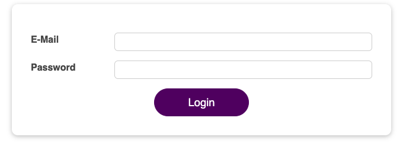
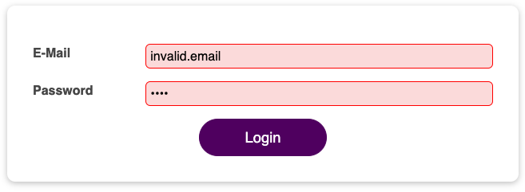
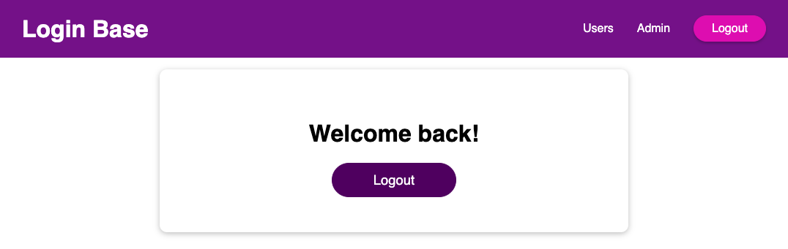

# Login Base

A React demo application that provides login services to users. This would allow users to get redirect to specific user interface based on their individual credentials.

### User interface

There are 3 main components to this application:

1. <strong>Login Form</strong>
   The login form component requests inputs from users for their emails and passwords. In addition, the form would also provide basic validation to the input emails and passwords. If user attempts to login with invalid input, the form would automatically focus on the input field that is invalid.

   
   *default login form*
   
   
   *invalid login input*

2. <strong>Main Header</strong>
   The main header components display header options based on the user is logged in or not

   
   *logged in main header*

3. <strong>Welcome Page</strong>
   The welcome page components is the potential location to have data and contents for logged in users.

   
   *welcome page*